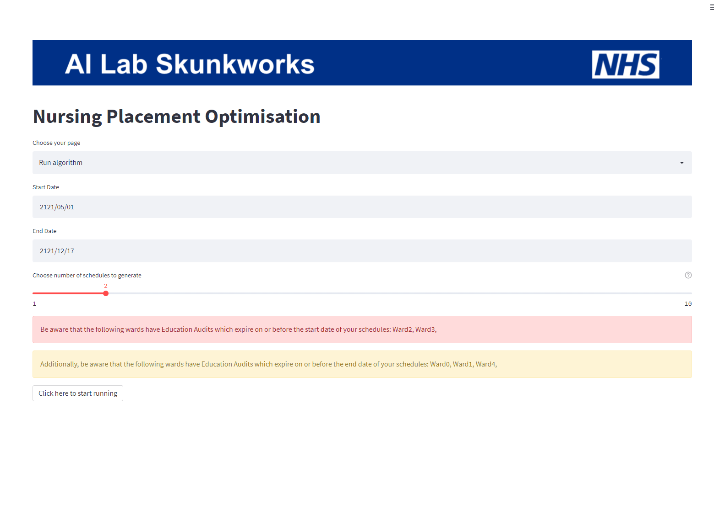
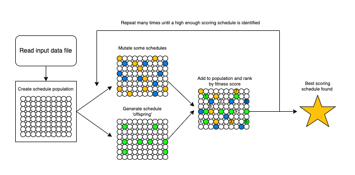
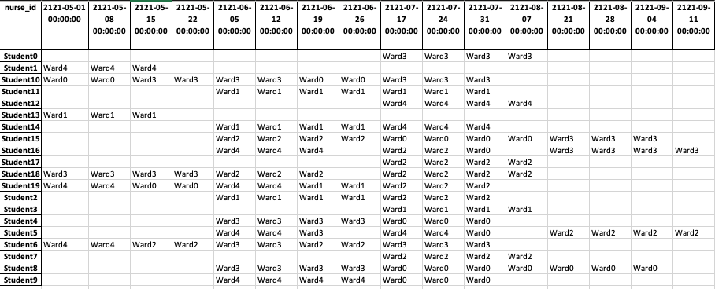
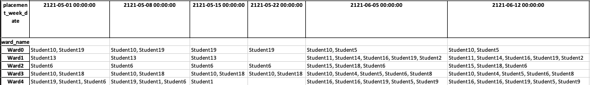
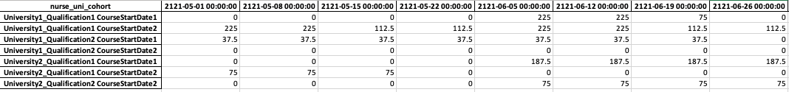

# NHS AI Lab Skunkworks project: Nursing Placement Optimisation

> A pilot project for the NHS AI (Artificial Intelligence)  Lab Skunkworks team, Nursing Placement Optimisation uses nursing student data from North West London Clinical Commissioning Group, with the pilot carried out for Imperial College Healthcare Trust, to generate placement schedules which meet a range of criteria.

This project is an example of the AI Skunkworks team offering capability resources to produce proof-of-concepts which could be applicable to the NHS at large. The project ran from January 2022 to May 2022.

## Background
Placement capacity is a major constraint in building out a hospital's workforce pipeline. The [Royal College of Nursing says](https://www.ed.ac.uk/files/imports/fileManager/RCNHelpingStudentsgettheBestfromtheirPracticePlacements.pdf) that "Learning in the contextual setting of clinical practice enables you to confront many of the challenges and issues related to caring. Practice is where lifelong learning is promoted and enhanced." and gives some benefits of undertaking placements as "continue to develop your competence in both interpersonal and practical skills" and "work within a wide range of rapidly changing health and social services that recognise the continuing nature of care" to give just two examples.

Placement teams in each Trust/organisation create individualised schedules for every learner that enters the Trust on placement. For larger Trusts, this means creating hundreds of schedules that meet the regulatory standards, curriculum requirements and placement capacity.
Typically, Trusts creates their schedules manually in spreadsheets. This is problematic for several reasons:
- Non-standardised spreadsheets preclude efficient use of system-wide placement capacity

- Information for mandatory reports must be manually copied from large spreadsheets

By combining the experience and knowledge of coordinators with the Nursing Placement Optimisation tool means we can ensure we are getting the best schedules for students in the following ways:
- Student placement schedules are optimised against the numerous required criteria

- Placement capacity is used in an optimal manner

- Opportunities for students to experience a range of placement settings are maximised

- Time is saved by placement coordinators, enabling them to focus on other tasks

Special thanks to Imperial College Healthcare NHS Trust who were pivotal in providing expertise and guidance in order for this tool to be developed.
## Placement Optimisation tool

The tool is presented as a web-based app, running in your web browser. The tool requires data to be in a specific format (see [Data Dictionary](config/input_data_dictionary.json)). When run, the tool ingests the data saved in the 'data' folder and converts it to the required format. With the data prepared, the tool runs the genetic algorithm which is implemented within it, and returns a number of schedules pre-specified by the user. The schedules are accompanied by a scoring document which score various aspects of each schedule for comparison against one another (for additional details, see the [UI documentation](docs/UI.md)). 

The schedules themselves consist of a number of tabs which enable views from the perspective of both the student and the ward, as well as reporting-based schedules which show hours and utilisation rate for each working week that the schedule covers. The schedules that are produced are different solutions or options to the same problem for the same set of students. In other words, they are different versions of the same schedule.

By producing a variety of schedules which are each strong in slightly different areas, the tool provides placement coordinators with a strong baseline on which the coordinator can impart their knowledge to get the best learning outcomes for the students, and the best allocation of students for the trust.

Within the src code files (`src/`), the classes and functions have been given docstrings to provide more specific information around what each piece of functionality does. Please see there for additional information on how the algorithm works.

The tool has demonstrated a robust capability to produce varied sets of placements which meet student needs and allow placement coordinators to have a range of options available on demand. The various reporting views also enable placement coordinators to facilitate changes or updates as required. One example might be that if a student needs a different placement to the one selected by the tool, the ward-centric utilisation tracker allows the placement coordinator to have a single view of each ward's capability to support another placement student.

### What does the tool produce?
The output of the tool is a number of schedules (the number selected by the user), which are scored across a number of metrics. The comparison file (named `schedule_comparison_[datetime].csv`) stores these metrics for each schedule, so that the pros and cons of each schedule can be assessed numerically, as well as by eye. 

Each schedule is presented in a variety of views including:
- A nurse-centric schedule view, enabling each student nurse to see their schedule for the coming weeks
- A ward-centric schedule view, enabling each ward to see which students they will have in a given week
- A ward-centric hours tracker, showing how many hours of student time a ward is supporting each week
- A cohort hours tracker, showing how many hours of student time each cohort has allocated each week
- A ward-centric utilisation tracker (both weekly and quarterly), showing the utilisation of student placements of a ward's overall capacity for each time period

Examples of the reports produced can be seen below (produced using fake data):

Nurse-centric schedule view:

Ward-centric schedule view:

Cohort hours tracker:

Ward-centric weekly utilisation tracker:

In addition, a log file will be generated for each run in the `log` folder named `nurse_opt_logging.log`. This will contain more granular information about the progress of the generation of each schedule, as well as any information if a schedule is found to be non-viable. Please note that this log file will wipe itself after each run of the tool to prevent very large log files from being created.

### Schedule constraints
The tool implements a number of rules, which if breached, render the schedule 'non-usable'. The tool might return non-usable schedules, depending on how the user-defined elements of rules are defined.

The rules implemented in the tool are can be found in the [Constraints documentation](docs/constraints.md)

### Schedule Goals
Alongside constraints, the tool has a number of goals that it tries to get the best outcome within. These are covered in the [Goals documentation](docs/goals.md)

## Documentation:

| Docs | Description |
| ---- | ----------- |
| [Genetic Algorithm](docs/ga.md) | Description of how the Genetic Algorithm class and how the algorithm works overall |
| [Schedule](docs/schedule.md) | Description of the Schedule class |
| [UI](docs/UI.md) | Description of what the UI shows and how to use it |
| [Goals](docs/goals.md) | Description of what the tool tries to optimise for and how to configure speciality goals |
| [Constraints](docs/constraints.md) | Full list of the constraints applied to this problem |

## Getting Started
This project requires Python 3.8.5+

Please note this tool was created and tested using MacOS Monterey 12.4 on an Intel chip.

1. Create your virtual environment using e.g. [venv](https://docs.python.org/3/library/venv.html) `python -m venv venv`
2. Activate your virtual environment using either `venv\scripts\activate` on Windows or `source venv/bin/activate` on MacOS
3. Install the required dependencies within the virtual environment using the requirements.txt e.g. `pip install -r requirements.txt`
4. Generate fake data using the built in Fake Data Generator (instructions [below](#using-fake-data))
5. The Streamlit interface is launched by calling `streamlit run ui.py`
6. Your results will be saved in the `results/` folder

### Using fake data

This repository includes a [fake data generator](fake_data_generation/) which generates a file of the required structure, allowing a test run of the tool to be done.

To run the test run using fake data, first generate the fake data by running:
`python fake_data_generation/generate_fake_data.py`

This will save a file called `fake_data.xlsx` to the `data/` directory.

Once that is done, you can launch the tool by running `streamlit run ui.py` and selecting `Fake data` from the `Select your data source` drop down.

### Using your own data

If you'd like to use your own data, the fake data generated shows the required structure. The main requirements are:
- A tab called 'students' containing the fields described under 'students' [here](config/input_data_dictionary.json)
- A tab called 'wards' containing the fields described under 'wards' [here](config/input_data_dictionary.json)
- A tab called 'placements' containing the fields described under 'placements' [here](config/input_data_dictionary.json)

Additional example data can be viewed by generating the fake data as above.

Your input data file will need to be stored in `data/` and its name added to `config/params.yml` in the `input_file_name` variable within `ui_params`.

If further support is needed, please get in touch with us for support: england.aiskunkworks@nhs.net

## Testing
A set of unit tests are provided as part of this code, intended to demonstrate the robustness of the functionality as well as providing a basis on which future function can be developed with intended behaviour outlined in these tests.

The tests are written using pytest, to run all tests, run the following from the top level directory (e.g. `skunkworks-nursing-placement-schedule-optimisation`):

`pytest --cov=src`

## NHS AI Lab Skunkworks
The project is carried out by the NHS AI Lab Skunkworks, which exists within the NHS AI Lab to support the health and care community to rapidly progress ideas from the conceptual stage to a proof of concept.

Find out more about the [NHS AI Lab Skunkworks](https://www.nhsx.nhs.uk/ai-lab/ai-lab-programmes/skunkworks/).

Join our [Virtual Hub](https://future.nhs.uk/connect.ti/system/text/register) to hear more about future problem-sourcing event opportunities.
Get in touch with the Skunkworks team at england.aiskunkworks@nhs.net.

## Acknowledgements
This tool is developed, in part, based on [GASchedule.py](https://github.com/mcychan/GASchedule.py) which was used as a starting point for this project

